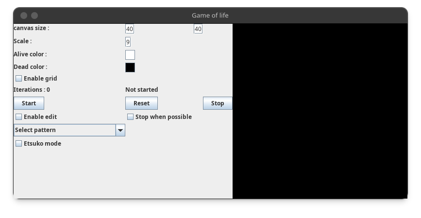

# Game of Life
- This is a java implementation of Conway's Game of Life.

## Usage
- Download the Jar file from the releases and run it with `java -jar game-of-life-java.jar`

## Example usage

https://github.com/Sydiepus/game-of-life-java/assets/49863809/d7782aa1-ba3d-46e7-a603-751aa555bb9a

## Motivation
- I wanted to learn java, and I stumbled across this video [Etsuko Yakushimaru - “I’m Humanity”](https://www.youtube.com/watch?v=92Dcp9Fbdac) which I found really fascinating and wanted to recreate it.
- Currently only the first part is implement, no maze generation.

## Features
- Finite canvas.
- Change color.
- Start and stop ability.
- Edit anytime.
- Enable/disable grid.
- Canvas size and scale.
- Ugly UI.

- Predefined patterns.

- Yakushimaru Etsuko mode, this mode is a recreation of the video mentioned above.

